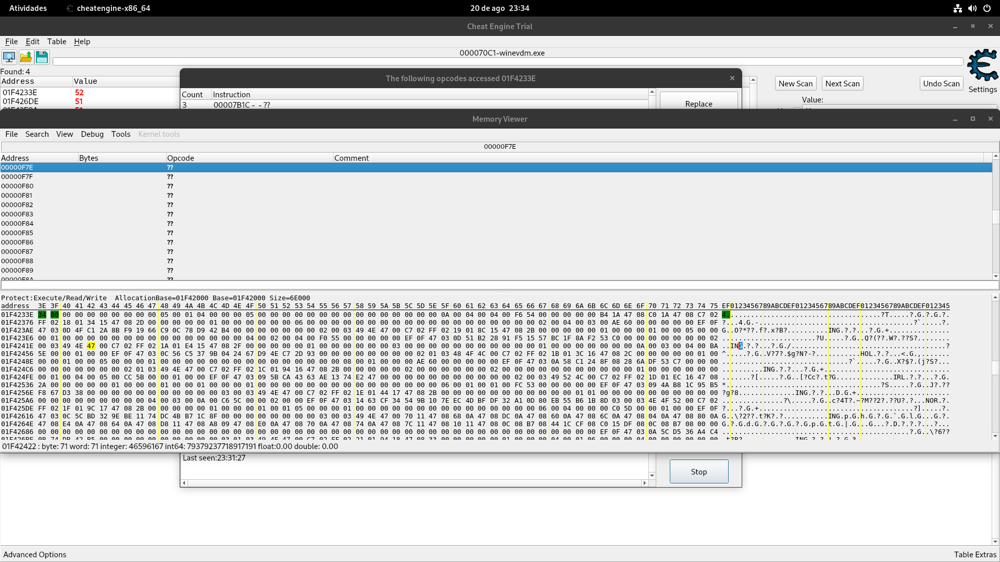
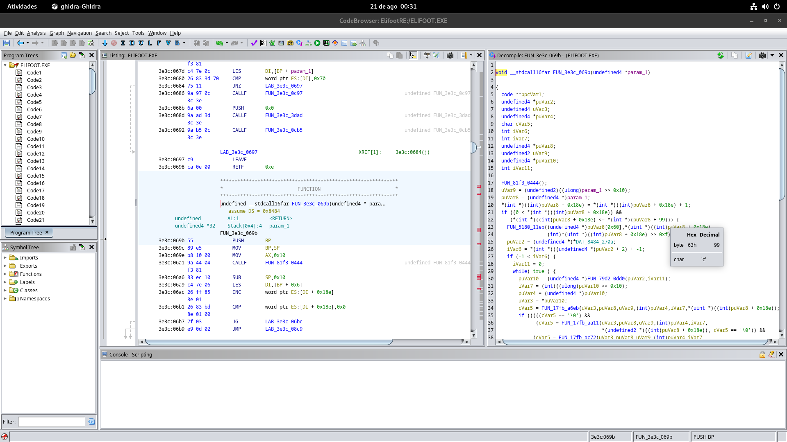
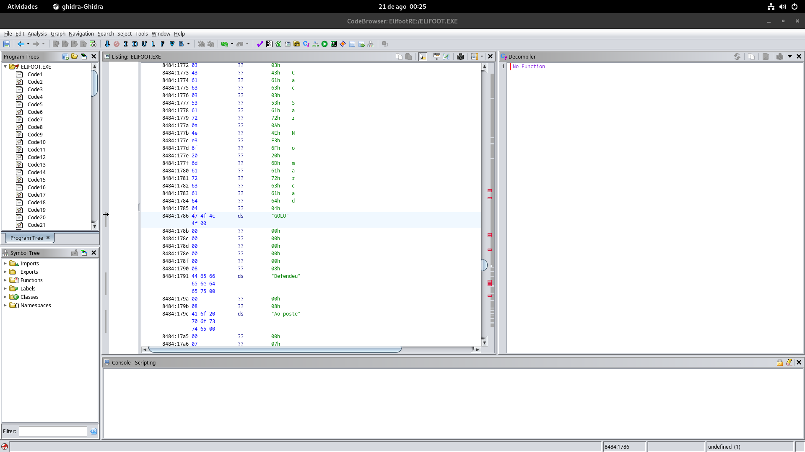

# ⚽ Desvendando o Elifoot 98: Engenharia Reversa e Análise do Motor de Jogo

[](https://ghidra-sre.org/)
[-red.svg)](https://www.debian.org/)
[-blue.svg)]()
[]()

Um mergulho técnico no código-fonte nativo do clássico **Elifoot 98** (versão original criada por André Elias). Através de engenharia reversa estática e dinâmica no Linux, este repositório documenta as fórmulas matemáticas, algoritmos de partidas, bônus ocultos e a comprovação definitiva de mitos que circularam em fóruns por mais de duas décadas.

---

## 🛠️ Ambiente e Ferramentas Utilizadas

* **Sistema Operacional:** Debian 12 (Bookworm)
* **Engenharia Reversa Estática:** [Ghidra (NSA)](https://ghidra-sre.org/)
* **Engenharia Reversa Dinâmica / Memória:** [Cheat Engine](https://www.cheatengine.org/) rodando sobre camada `winevdm`
* **Camada de Execução:** Wine (Wine Virtual DOS Machine para binários de 16 bits)
* **Binário Analisado:** `ELIFOOT.EXE` (16-bit New Executable - Borland Delphi 1.0 / Turbo Pascal)

---

## 📊 Resumo Executivo: Fato vs Mito

| Mecânica Popular | Veredito no Código | Explicação Matemática |
| :--- | :---: | :--- |
| **Jogar sem Médios (5-0-5)** | **FATO (Meta Real)** | Médios diluem a força (50% Ataque / 50% Defesa). Não existe penalidade de posse de bola no código. |
| **Bônus de Mesma Nacionalidade** | **FATO** | O algoritmo pré-jogo soma **$+3$ pontos brutos** por cada titular da mesma nacionalidade do clube. |
| **Mando de Campo Gigante** | **FATO** | Divisores de probabilidade assimétricos (`Random(6000)` em casa vs `Random(7000)` fora). |
| **Zagueiro Agressivo desarma melhor** | **MITO** | O desarme depende $100\%$ da força nominal. Agressividade atua apenas como peso na roleta de faltas/cartões. |
| **Estádio Lotado intimida adversário** | **MITO** | A torcida tem papel $100\%$ financeiro (bilheteria). O bônus de campo é um valor fixo no código. |
| **Moral Individual / Insatisfação** | **MITO** | O contrato é puramente um contador regressivo de jogos. Jogador com 1 jogo restante joga com rendimento máximo. |
| **Goleiros demoram mais a evoluir** | **FATO** | Goleiros passam por um teste probabilístico extra de $50\%$ (`Random(2) == 0`) para subir de força. |

---

## 🔍 1. A Estrutura do Jogador na Memória



Ao inspecionar a memória viva do jogo (`DS = 0x8484`), identificamos que cada jogador ocupa uma `struct` contígua de apenas **~32 a 48 bytes**. 

Não existem atributos ocultos como "fôlego", "drible", "passe" ou "potencial secreto". O jogador é composto unicamente por:

* `0x00`: Força Nominal (1 a 50)
* `0x02`: Posição de Origem (`0` = Goleiro, `1` = Defesa, `2` = Médio, `3` = Ataque)
* `0x04`: Sigla de Nacionalidade em texto ASCII (`"BRA"`, `"ING"`, `"POR"`, `"NOR"`, etc.)
* `0x08`: Jogos de Contrato Restantes
* `0x0A`: Salário / Valor de Mercado
* `0x0E`: Estado Disciplinar / Cartões e Lesões

---

## 🧮 2. A Fórmula de Força do Time e o Bônus de Nacionalidade

Função descompilada: **`FUN_17fb_397d`**

Antes do início da partida, o jogo calcula a força de cada um dos 4 setores (Goleiro, Defesa, Meio-Campo e Ataque). O código comprovou que a **força entra multiplicada por 2** e atletas locais ganham **$+3$ de bônus**:

```c
void CalcularForcaSetores(TeamStruct *time) {
    // Zera os 4 setores: [0]=Goleiro (0x51), [1]=Defesa (0x53), [2]=Médio (0x55), [3]=Ataque (0x57)
    for (int i = 0; i <= 3; i++) {
        time->SetorForca[i] = 0;
    }

    for (int i = 0; i < time->TotalJogadores; i++) {
        PlayerSlot *slot = time->Elenco[i];

        if (slot->isTitular == 1) {
            PlayerData *jogador = slot->dadosJogador;

            // Compara País do Clube (0x4a) com Nacionalidade do Atleta (0x1b)
            bool mesmoPais = (CompareStr(time->PaisClube, jogador->Nacionalidade) == 0);
            int setor = jogador->Posicao; 

            // FÓRMULA DO SETOR:
            time->SetorForca[setor] += (jogador->Forca * 2) + (mesmoPais * 3) + slot->BonusPosicao;
        }
    }
}
```

$$\text{Poder do Setor} = \sum_{\text{Titulares}} \Big( (\text{Força} \times 2) + (\text{Mesma Nacionalidade} \times 3) + \text{Ajuste de Posição} \Big)$$

---

## ⏱️ 3. O Motor de Simulação de Partidas e Gols



Funções descompiladas: **`FUN_3e3c_069b`**, **`FUN_17fb_a6eb`**, **`FUN_17fb_46df`** e **`FUN_17fb_c1bf`**

O relógio avança minuto a minuto de 1 a 90 (`[puVar8 + 0x18e] = minuto + 1`). A cada minuto, o jogo executa o seguinte pipeline:

### 3.1. Geração de Chances (Mando de Campo Assimétrico)
* **Time Mandante (Casa):** `Random(6000) < Força_Ofensiva_Casa`
* **Time Visitante (Fora):** `Random(7000) < Força_Ofensiva_Fora`

### 3.2. Gerador Secundário / Anti-Goleada (`FUN_17fb_46df`)
* **Casa:** `Random(90) < Limiar - (Remates + Gols)` ou `Random(180) == 0` (*Lucky roll* de 0,55%/min).
* **Fora:** `Random(120) < Limiar - (Remates + Gols)` ou `Random(270) == 0` (*Lucky roll* de 0,37%/min).

### 3.3. Duelo Tático (`FUN_17fb_81ed`)
O atacante sorteado disputa o lance contra a defesa:
$$\text{Duelo} = \text{Random}(\text{Força\_Atacante}) \text{ vs } \text{Random}(\text{Força\_Defensor})$$

### 3.4. Resolução da Finalização (`FUN_17fb_c1bf`)
A jogada acessa a matriz de desfechos:
* `0` $\rightarrow$ **`"GOLO"`** (Placar incrementado)
* `1` $\rightarrow$ **`"Defendeu"`** (Defesa do goleiro)
* `2` $\rightarrow$ **`"Ao poste"`** (Bola na trave vertical)
* `3` $\rightarrow$ **`" barra"`** (Bola no travessão)
* `4` $\rightarrow$ **`"Para fora"`**



---

## ⚡ 4. Por que a Tática 5-0-5 "Quebra" o Jogo?

Como o motor não calcula porcentagem de posse de bola no círculo central:
* **Médios:** Entregam 50% no ataque e 50% na defesa (força diluída).
* **Atacantes e Defensores:** Entregam 100% no seu setor.

Escalar **5 Defesas e 5 Atacantes (5-0-5)** elimina o desperdício estatístico dos médios, gerando o maior pico de ataques por minuto no ataque e a barreira mais impenetrável na defesa simultaneamente.

---

## 📈 5. O Algoritmo de Evolução e Queda de Força

Função descompilada: **`FUN_17fb_4a41`**

A evolução ocorre rodada a rodada no pós-jogo com base na moral e na titularidade:

```c
void AtualizarEvolucaoForca(TeamStruct *time, int nivelBaseTime) {
    for (int i = 0; i < time->TotalJogadores; i++) {
        PlayerSlot *slot = time->Elenco[i];
        int avaliacao = AvaliarRendimento(slot->desempenho);

        // GANHO DE FORÇA (+1)
        if (avaliacao == 1) {
            // Goleiro (Posicao == 0) precisa vencer um sorteio extra de 50%
            if ((slot->Posicao != 0) || (Random(2) == 0)) {
                if (slot->Forca < 50 && slot->Forca <= nivelBaseTime + 5) {
                    slot->Forca += 1;
                }
            }
        }
        // PERDA DE FORÇA (-1)
        else if (avaliacao == -1) {
            // 50% de tolerância antes de perder força
            if (Random(2) == 0 && slot->Forca > 1 && slot->Forca >= nivelBaseTime - 5) {
                slot->Forca -= 1;
            }
        }
    }
}
```

---

## 🛡️ 6. Disciplina e Comportamento: A Roleta de Cartões

Funções descompiladas: **`FUN_17fb_100b`** e **`FUN_17fb_81ed`**

* O comportamento (**Muito Correto, Correto, Normal, Agressivo, Muito Agressivo**) **não concede bônus de desarme**.
* Ele atua como peso em uma **Roleta Ponderada (*Weighted Random Selection*)**: atletas agressivos recebem fatias maiores na roleta de infrações e são sorteados com muito mais frequência para receber cartões amarelos e vermelhos.
* **Veredito:** Atletas "Muito Corretos" são matematicamente superiores.

---

## 📜 Licença e Isenção de Responsabilidade

Este projeto possui finalidade **exclusivamente educacional, de pesquisa e de preservação histórica**.
O jogo original *Elifoot 98* é de autoria e propriedade de **André Elias**. Nenhum arquivo binário executável comercial proprietário está hospedado neste repositório.
